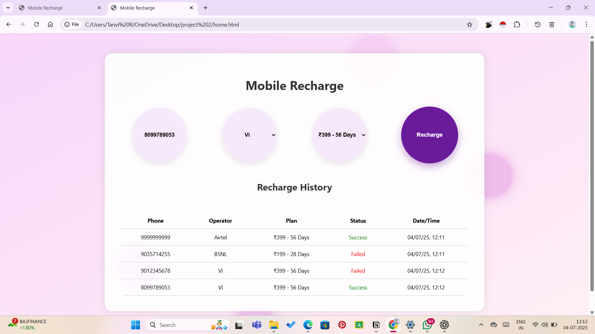
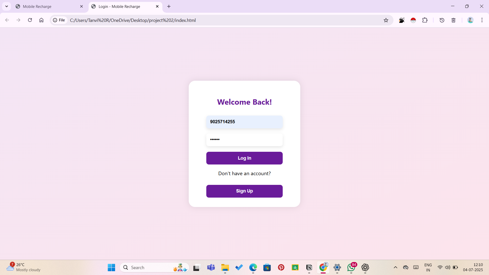
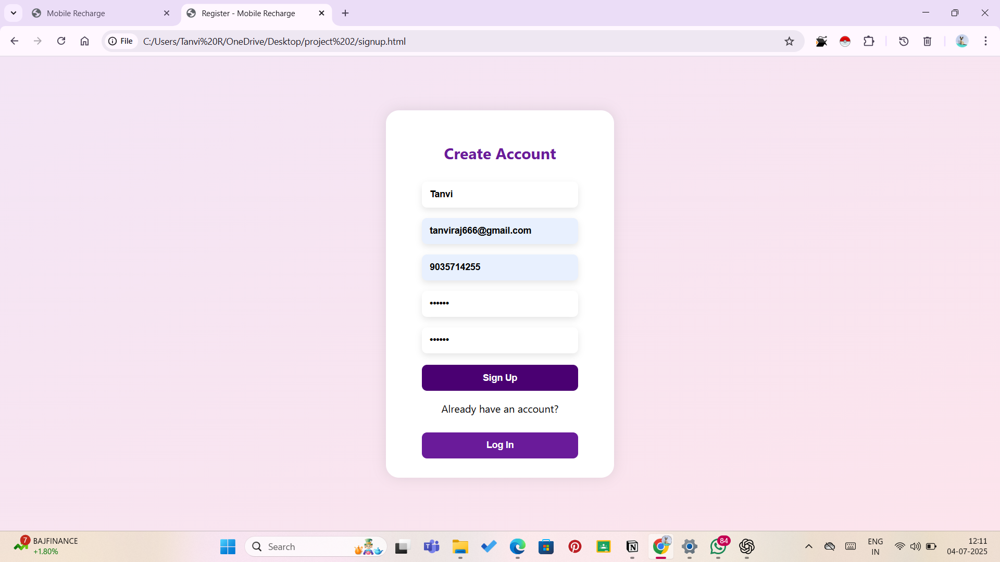

# Mobile Recharge Platform

A responsive frontend for a mobile recharge platform, built using HTML, CSS, and JavaScript. This project was developed during my internship at Tecktoniq, focusing on modern UI design and interactive recharge functionality.

## Live Demo

**Website:** https://tanvirajappa.github.io/mobile-recharge-platform/

# Features

📱 Responsive design for desktop & mobile

🔄 Interactive recharge form with validation

🎨 Clean and user-friendly UI

⚡ Built with HTML, CSS, JavaScript

# Screenshots

# Homepage
  

# Login Page  
  

# Signup Page  

# Installation

1. Clone the repo:

   git clone https://github.com/your-username/mobile-recharge-frontend.git

2. Open index.html in your browser.

# Usage

Select your operator

Enter mobile number & recharge amount

Submit to simulate recharge flow

# Tech Stack

HTML

CSS

JavaScript

# 📌 Acknowledgments

Developed as part of my internship at Tecktoniq.

# Notes

This repository showcases front-end work only from my internship.

No backend integration yet.

Screenshots have been added to demonstrate the interface.

# Author

Tanvi Rajappa
